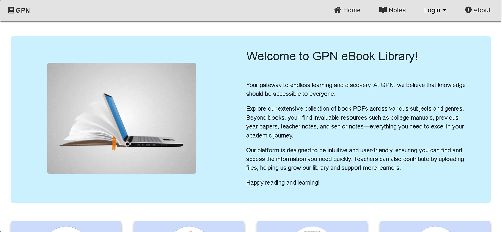
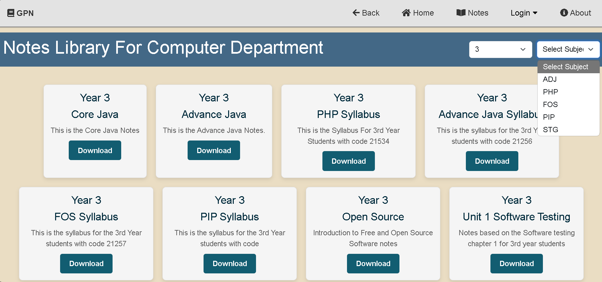
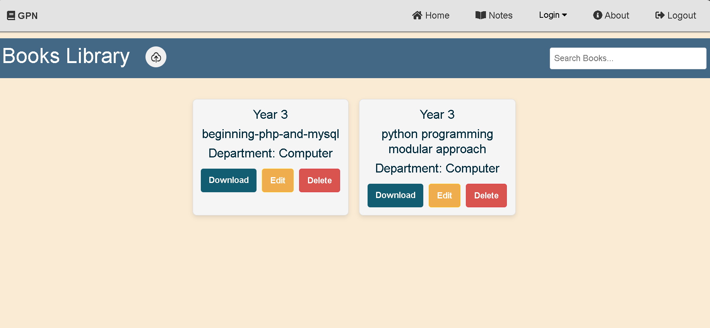
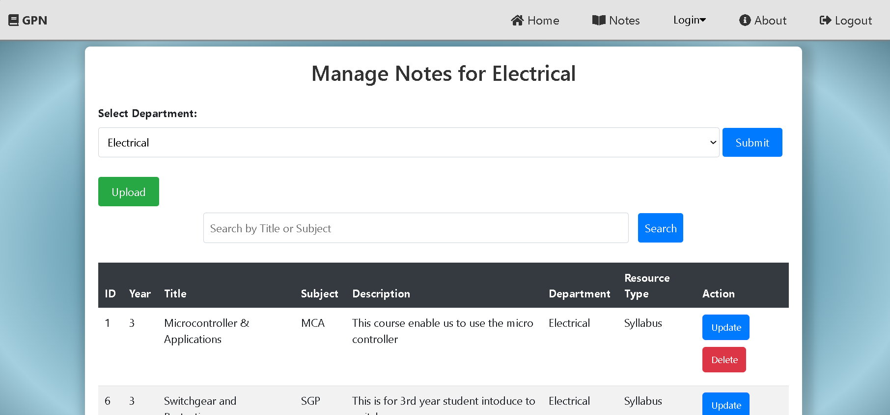
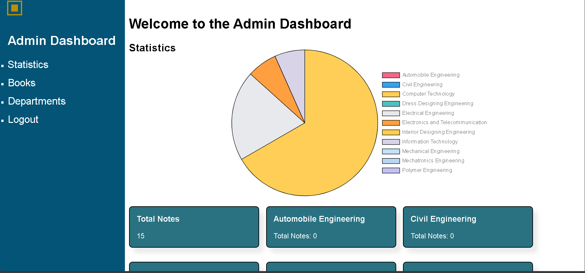

# 📚 E-Book Management System for GPN

An online platform designed to help students and faculty efficiently manage and access **notes and e-books**, organized **branch-wise** and **year-wise**. The system supports **admin** and **teacher logins** for secure upload and management of academic materials.

---

## 🌟 Features

* 🔐 **Admin & Teacher Authentication**
  * Admins manage teachers, categories, and e-book uploads.
  * Teachers can upload notes and e-books by branch and year.
* 📂 **Branch & Year-Based Organization**
  * Materials are categorized by department (e.g., Computer, Mechanical) and academic year (e.g., 1st Year, 2nd Year).
* 📖 **E-Book Collection**
  * Upload, view, and download study materials in various formats (PDF, DOCX, etc.)
* 🔍 **Search & Filter**
  * Quickly search resources by title, branch, or year.
* 📱 **Responsive Design**
  * Clean UI using **HTML**, **CSS**, and **Bootstrap** for mobile and desktop.

---

## 🛠️ Tech Stack

| Layer        | Technology           |
| ------------ | -------------------- |
| **Frontend** | HTML, CSS, Bootstrap |
| **Backend**  | PHP                  |
| **Database** | MySQL                |

---

## 📸 Screenshots(Some snaps of website)


#### 🏠 Home Page  


#### 🏛️ Department Section  


#### 📝 Notes Section  


#### 📚 E-Book Library  


#### 👨‍🏫 CRUD for Teachers (Notes)  


#### 🛠️ Admin Dashboard  


---

## 🚀 How to Run Locally

1. **Clone the Repository**
```bash
git clone https://github.com/bhumika-chaudhari/E-Book-Management-for-GPN.git
cd E-Book-Management-for-GPN
